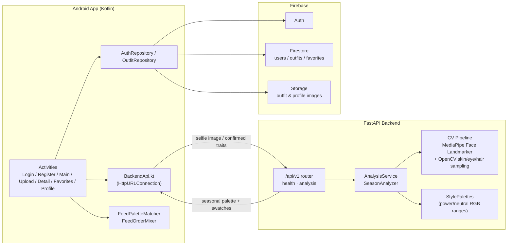

# StylePalette

<p align="center">
  <b>Personal color analysis for smarter outfit discovery.</b><br/>
  A native Android app that analyzes a selfie against professional Seasonal Color Theory and helps users build/curate an outfit feed that matches their personal palette.
</p>

<p align="center">
  
  
  
  
  
  
  
</p>

---

## Description

StylePalette is a two-part project:

1. **Android app** (`/app`) — a Kotlin app where users sign up, take a selfie for color analysis, browse a community outfit feed, upload their own outfits (garment-by-garment with picked colors), like/favorite outfits, and filter the feed to outfits that match their personal color palette.
2. **FastAPI backend** (`/backend`) — a computer-vision service that detects a face in an uploaded selfie (MediaPipe Face Landmarker), samples skin/eye/hair color (OpenCV), classifies the user into one of four color "Seasons" (Winter, Summer, Autumn, Spring) using a rule-based Seasonal Color Theory engine, and returns a recommended clothing color palette.

Authentication, the outfit feed, and outfit storage are handled entirely by **Firebase** (Auth, Firestore, Storage). The **FastAPI backend** is only responsible for the selfie → color-trait → seasonal-palette analysis. The two are otherwise independent services that the Android app orchestrates.

## Features

**Android app**
- Email/password authentication (Firebase Auth)
- Selfie-based personal color analysis with an editable trait-confirmation step
- Personal seasonal palette (Winter / Summer / Autumn / Spring) with power & neutral color swatches, stored per user
- Community outfit feed with search-by-vibe, search-by-store/garment, and "Match My Palette" filtering
- Feed de-clustering/interleaving so one user's posts don't dominate consecutive slots
- Outfit upload with a per-garment (top, bottom, jacket, shoes, jewelry, sunglasses, bag) color picker (common swatches, extended HSV grid, or color wheel)
- Favorites/wishlist (like an outfit to save it)
- Profile screen with palette summary, sampled trait colors, and a grid of the user's own outfits
- Firebase Storage-backed images for outfits and profile pictures
- Firebase App Check (Play Integrity in release, Debug provider in development)

**Backend**
- `POST /api/v1/analysis/selfie` — upload a JPEG/PNG selfie, get back estimated skin tone / eye color / hair color, sampled RGB for each, a seasonal palette label, confidence, and a full power/neutral color recommendation
- `POST /api/v1/analysis/palette-from-traits` — submit user-confirmed trait labels (and optional measured RGB samples) to get the same palette recommendation without re-running CV
- `GET /api/v1/health` — liveness check
- MediaPipe Face Landmarker model is downloaded automatically on first use (configurable), or a local `.task` file / custom URL can be supplied
- CORS is configurable via environment variables for local Android emulator/device testing

## Screenshots

> Screenshots are not yet included in this repository. Add captures of the key screens below (e.g. as `docs/screenshots/*.png`) and reference them here.

| Login / Register | Selfie Palette Result | Feed | Upload Outfit | Profile |
|---|---|---|---|---|
| _add screenshot_ | _add screenshot_ | _add screenshot_ | _add screenshot_ | _add screenshot_ |

## Architecture



**Onboarding / palette flow:**
1. `RegisterActivity` creates the Firebase Auth account and lets the user take/upload a selfie.
2. The app sends the selfie to `POST /api/v1/analysis/selfie`. The backend detects facial landmarks, samples skin/eye/hair color, classifies each trait, runs the seasonal analysis, and returns estimated traits + a recommended palette.
3. The user can review/correct the detected skin tone, eye color, and hair color in on-screen spinners.
4. The app sends the confirmed traits to `POST /api/v1/analysis/palette-from-traits`, which re-derives the season and palette from the confirmed labels.
5. The resulting `PersonalPalette` (season, description, power/neutral RGB swatch ranges, sampled trait colors) is saved to the user's Firestore document.

**Feed / discovery flow:**
- `MainActivity` streams the global `outfits` collection from Firestore, applies text filters (vibe / store or garment keyword), and — when the user enables "Match My Palette" — filters outfits whose garment colors fall inside the user's power/neutral swatch RGB ranges (`FeedPaletteMatcher`).
- The feed is then de-clustered so consecutive posts from the same author are avoided where possible (`FeedOrderMixer`).
- Users can like outfits (stored in a `favorites` subcollection), upload their own outfits with a per-garment color picker, and view/delete their own outfits.

## Repository Structure

```
StylePalette/
├── app/                                  # Android application (Gradle project root)
│   ├── app/
│   │   ├── build.gradle.kts              # applicationId, minSdk 26 / targetSdk 36, dependencies
│   │   ├── google-services.json          # Firebase project config
│   │   └── src/main/java/com/example/myapplication/
│   │       ├── App.kt                    # Application class, Firestore/App Check setup
│   │       ├── BaseActivity.kt           # Shared bottom-nav wiring
│   │       ├── LoginActivity.kt / RegisterActivity.kt
│   │       ├── MainActivity.kt           # Outfit feed, search, palette filter
│   │       ├── UploadOutfitActivity.kt   # Create outfit + per-garment color picker
│   │       ├── OutfitDetailActivity.kt   # View/delete a single outfit
│   │       ├── FavoritesActivity.kt      # Liked outfits
│   │       ├── ProfileActivity.kt        # Palette summary + user's outfits
│   │       ├── BackendApi.kt             # HTTP client for the FastAPI backend
│   │       ├── FeedOrderMixer.kt         # Feed interleaving algorithm
│   │       ├── FeedPaletteMatcher.kt     # Palette-based outfit filtering
│   │       ├── adapters/OutfitAdapter.kt
│   │       ├── ui/OutfitColorPicker.kt
│   │       ├── repository/               # AuthRepository, OutfitRepository (Firestore/Storage)
│   │       └── models/                   # Outfit, OutfitRgb, PersonalPalette, PaletteSwatch, User, ...
│   └── firestore.rules                   # Firestore security rules
│
└── backend/                              # FastAPI backend
    ├── RestAPI.py                        # Uvicorn ASGI entrypoint
    ├── requirements.txt
    ├── .env.example
    └── app/
        ├── main.py                       # FastAPI app factory, CORS, router mounting
        ├── config.py                     # Settings (host/port, CORS, MediaPipe model options)
        ├── api/v1/
        │   ├── router.py
        │   └── endpoints/{health,analysis}.py
        ├── services/
        │   ├── analysis.py               # Trait classification + orchestration
        │   └── season_analyzer.py        # Seasonal Color Theory rule engine
        ├── domain/
        │   ├── enums.py                  # SkinType, HairColor, EyeColor, Season
        │   └── style_palettes.py         # Power/neutral RGB ranges per season
        ├── cv/
        │   ├── detection.py              # MediaPipe Face Landmarker loading/inference
        │   ├── skin.py / eyes.py / hair.py
        │   └── facial_color_analysis.py
        └── schemas/                      # Pydantic request/response models
```

## Android App

- **Language/UI**: Kotlin 2.0.21, XML layouts (AndroidX AppCompat, Material Components, ConstraintLayout) — no Jetpack Compose.
- **App ID**: `com.example.myapplication`, `minSdk 26`, `targetSdk/compileSdk 36`, Java 11 bytecode target.
- **Screens**: `LoginActivity`, `RegisterActivity` (auth + selfie palette onboarding), `MainActivity` (feed), `UploadOutfitActivity`, `OutfitDetailActivity`, `FavoritesActivity`, `ProfileActivity`, wired together via a shared bottom navigation bar (`BaseActivity`).
- **Firebase integration**: Auth (email/password), Firestore (`users`, `outfits`, per-user `favorites` subcollection), Storage (`outfits/{id}.jpg`, `profile_images/{uid}.jpg`), and App Check (Debug provider for development, Play Integrity for release).
- **Backend integration**: `BackendApi.kt` talks to the FastAPI service over plain `HttpURLConnection` (multipart selfie upload + JSON trait-correction calls); the base URL is configured via the `backend_analysis_base_url` string resource and supports local IPs or an `ngrok` tunnel.
- **Palette matching**: `FeedPaletteMatcher` checks whether a garment's RGB falls inside any of the user's power/neutral swatch ranges; `FeedOrderMixer` interleaves the feed so the same author doesn't appear in consecutive slots.
- **Color picking**: `OutfitColorPicker` wraps the [Dhaval2404 ColorPicker](https://github.com/Dhaval2404/ColorPicker) library to let users assign a color per garment when uploading an outfit.
- **Tests**: JUnit unit tests under `app/app/src/test` (e.g. `FeedOrderMixerTest`), plus an instrumented test scaffold under `androidTest`.

## Backend API

The backend is a FastAPI service exposing a single analysis domain under `/api/v1`:

- **`app/main.py`** builds the FastAPI app, configures CORS from settings, and mounts the versioned router.
- **`app/cv/`** implements the computer-vision pipeline: `detection.py` loads/downloads the MediaPipe Face Landmarker model and runs landmark detection; `skin.py`, `eyes.py`, and `hair.py` sample region colors from landmark-based masks and classify them (skin tone via relative luminance, hair via HSV thresholds, eyes via HSV + Lab thresholds); `facial_color_analysis.py` orchestrates the three.
- **`app/services/season_analyzer.py`** runs the rule-based Seasonal Color Theory engine — a temperature (warm/cool) test, a contrast (high/low) test, and a chroma/value (clear-muted, light-deep) test — to classify a user into **Winter**, **Summer**, **Autumn**, or **Spring**.
- **`app/domain/style_palettes.py`** maps each season to a curated set of power and neutral colors, expressed as inclusive RGB ranges.
- **`app/services/analysis.py`** ties it together: running the CV pipeline on a selfie, or deriving a palette directly from user-confirmed trait labels.

| Season | Description |
|---|---|
| **Winter** | Bold, icy, high-contrast colors with a blue base |
| **Summer** | Cool, soft, muted pastel tones with a blue base |
| **Autumn** | Rich, earthy, deep colors with a gold base |
| **Spring** | Bright, warm, clear colors with a yellow base |

## Installation

### Prerequisites
- **Backend**: Python 3.10+
- **Android**: Android Studio, JDK 11, Android SDK (minSdk 26 / targetSdk 36)

### Clone the repository
```bash
git clone https://github.com/aviv-shemesh/StylePalette.git
cd StylePalette
```

## Running the Backend

```bash
cd backend
python -m venv venv
source venv/bin/activate        # Windows: venv\Scripts\activate
pip install -r requirements.txt

cp .env.example .env            # adjust HOST/PORT/CORS_ORIGINS as needed

uvicorn RestAPI:app --reload --host 0.0.0.0 --port 8000
```

Relevant `.env` options (see `backend/.env.example`):

| Variable | Purpose |
|---|---|
| `HOST`, `PORT`, `DEBUG` | Server bind settings |
| `CORS_ORIGINS` | Comma-separated allowed origins (Android emulator commonly uses `http://10.0.2.2:8000`) |
| `MEDIAPIPE_ALLOW_MODEL_DOWNLOAD` | If `true` (default), downloads `face_landmarker.task` from Google on first analysis |
| `MEDIAPIPE_FACE_LANDMARKER_MODEL` | Optional path to a local `.task` model file |
| `MEDIAPIPE_FACE_LANDMARKER_URL` | Optional override download URL |

Once running, interactive API docs are available at `http://localhost:8000/docs`.

## Running the Android App

1. Open the `/app` directory in Android Studio.
2. The project already includes a Firebase `google-services.json` — replace it with your own Firebase project's config for Auth/Firestore/Storage if you're not using the bundled one.
3. Point the app at your backend by editing the `backend_analysis_base_url` string resource (`app/app/src/main/res/values/strings.xml`) — e.g. `http://10.0.2.2:8000` for the Android emulator, your machine's LAN IP for a physical device, or an `ngrok` tunnel URL (ngrok URLs are auto-detected and sent with a bypass header).
4. Sync Gradle and run the `app` module on an emulator or device.

## API Endpoints

| Method | Path | Description |
|---|---|---|
| `GET` | `/api/v1/health` | Liveness/status check |
| `POST` | `/api/v1/analysis/selfie` | Multipart selfie upload → estimated traits, sampled colors, seasonal palette |
| `POST` | `/api/v1/analysis/palette-from-traits` | JSON body of confirmed skin/eye/hair labels → seasonal palette |

Full request/response schemas are defined in `backend/app/schemas/analysis.py` and served live via FastAPI's `/docs` and `/redoc`.

## Technologies

**Android**
- Kotlin 2.0.21, XML layouts (AndroidX AppCompat, Material Components, ConstraintLayout)
- Firebase BoM 34.8.0: Auth, Firestore, Storage, Analytics, App Check (Debug + Play Integrity)
- Glide 4.16.0 (image loading), Lottie 6.7.1 (animations)
- [Dhaval2404 ColorPicker](https://github.com/Dhaval2404/ColorPicker) 2.3 for garment color selection
- Plain `HttpURLConnection` for calling the FastAPI backend (no Retrofit/OkHttp dependency)
- JUnit for unit tests

**Backend**
- Python + [FastAPI](https://fastapi.tiangolo.com/) + Uvicorn (ASGI)
- Pydantic v2 / `pydantic-settings` for typed config (`.env`)
- OpenCV (`opencv-python-headless`) + NumPy for color-space math (HSV, Lab, luminance)
- [MediaPipe](https://developers.google.com/mediapipe) Face Landmarker for face detection/landmarks
- `python-multipart` for selfie upload handling

## Future Improvements

These are potential directions for the project, based on gaps observed in the current codebase — not implemented features:

- Add an automated test suite for the backend (currently no `pytest`/CI-based tests exist).
- Add a CI/CD pipeline (no GitHub Actions or other CI configuration is currently present).
- Move the Android networking layer from raw `HttpURLConnection` to Retrofit/OkHttp for more robust error handling and testability.
- Replace the hardcoded `backend_analysis_base_url` with a build-variant-based or runtime-configurable endpoint instead of editing `strings.xml` directly.
- Containerize the backend (no `Dockerfile`/`docker-compose` currently included) to simplify deployment.
- Add a `LICENSE` file (the repository does not currently declare a license).
- Wire up `FeedFilters.selectedVibe` end-to-end, or remove it if superseded by the free-text vibe search.

## Authors

- **Aviv Shemesh** — [@aviv-shemesh](https://github.com/aviv-shemesh)
