<div align="center">

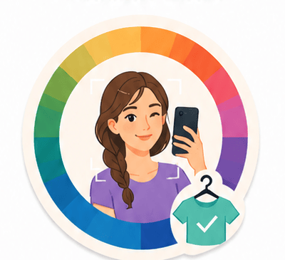

# StylePalette

**A mobile application for personalized fashion recommendations based on personal color analysis.**


<br/>


</div>

---

## 📖 Project Overview

StylePalette is a **B.Sc. Computer Science final project** (Afeka Academic College of Engineering, 2025–2026) consisting of two parts:

1. **Android app** (`/app`) — a Kotlin social app where users sign up, take a selfie for personal color analysis, browse a community outfit feed, upload their own outfits with per-garment colors and store names, favorite outfits, and filter the feed to outfits that match their personal color palette.
2. **FastAPI backend** (`/backend`) — a computer-vision service that detects a face in a selfie (MediaPipe Face Landmarker), samples skin/eye/hair color (OpenCV), classifies the user into one of four **seasonal color palettes** (Winter, Summer, Autumn, Spring) using a rule-based Seasonal Color Theory engine, and returns a recommended clothing color palette.

Authentication, the outfit feed, and media storage are handled by **Firebase** (Auth, Firestore, Storage). The **FastAPI backend** is only responsible for the selfie → color-trait → seasonal-palette analysis; the Android app orchestrates both services.

## 💡 Motivation

Shopping today suffers from a "wardrobe paradox": people buy plenty of clothes yet still feel they have nothing to wear. Two causes drive this:

- **Physiological mismatches** — garments bought impulsively (especially online) often don't match the buyer's skin, hair, and eye coloring, so they end up rarely worn.
- **Lack of inspiration and context** — many people don't know how to combine separate items into a complete, occasion-appropriate outfit.

Professional stylists solve this, but at a cost and inconvenience that puts them out of reach for daily use. StylePalette brings that expertise to a smartphone: it automatically diagnoses a user's personal color palette from a selfie, then filters a social feed of real outfits down to the ones that are actually likely to suit them — while also surfacing which store or brand each item came from, connecting inspiration directly to a purchase decision.

## ✨ Main Features

**Android app**
- 🔐 Email/password authentication (Firebase Auth)
- 🤳 Selfie-based personal color analysis with an editable trait-confirmation step
- 🎨 Personal seasonal palette (Winter / Summer / Autumn / Spring) with power & neutral color swatches, stored per user
- 🧵 Community outfit feed with search-by-vibe and search-by-store filtering
- 🪄 **"Match My Palette"** — a one-tap filter that shows only outfits whose garment colors fall inside the viewer's personal palette
- 🔀 Feed de-clustering/interleaving so one user's posts don't dominate consecutive slots
- 📤 Outfit upload with a per-garment (top, bottom, jacket, shoes, jewelry, sunglasses, bag) color picker (common swatches, extended HSV grid, or color wheel) and per-garment store/brand tagging
- ❤️ Favorites/wishlist (like an outfit to save it for later)
- 👤 Profile screen with palette summary, sampled trait colors, and a grid of the user's own outfits
- ☁️ Firebase Storage-backed images for outfits and profile pictures
- 🛡️ Firebase App Check (Play Integrity in release, Debug provider in development)

**Backend**
- `POST /api/v1/analysis/selfie` — upload a JPEG/PNG selfie, get back estimated skin tone / eye color / hair color, sampled RGB for each, a seasonal palette label, confidence, and a full power/neutral color recommendation
- `POST /api/v1/analysis/palette-from-traits` — submit user-confirmed trait labels (and optional measured RGB samples) to get the same palette recommendation without re-running computer vision
- `GET /api/v1/health` — liveness check
- MediaPipe Face Landmarker model is downloaded automatically on first use (configurable), or a local `.task` file / custom URL can be supplied
- CORS is configurable via environment variables for local Android emulator/device testing

## 🔄 Application Workflow

The diagram below (from the project's design documentation) traces a full cycle: a selfie becomes a personal palette, and that palette becomes a filtered, personalized feed.

<div align="center">
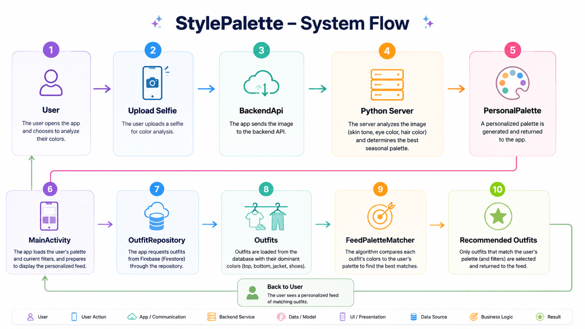
</div>

1. **User** opens the app and chooses to analyze their colors.
2. **Upload Selfie** — the user uploads or captures a selfie for color analysis.
3. **BackendApi** sends the image to the backend API.
4. **Python Server** analyzes the image (skin tone, eye color, hair color) and determines the best seasonal palette.
5. **PersonalPalette** is generated and returned to the app, then saved to the user's Firestore profile.
6. **MainActivity** loads the user's palette and current filters when the feed opens.
7. **OutfitRepository** requests outfits from Firestore.
8. **Outfits** are loaded with their dominant garment colors (top, bottom, jacket, shoes, jewelry, sunglasses, bag).
9. **FeedPaletteMatcher** compares each outfit's colors to the user's palette to find matches.
10. **Recommended Outfits** — only outfits that match the user's palette (and any active text filters) are shown back to the user.

## 📸 Screenshots

<table>
<tr>
<td align="center" width="33%">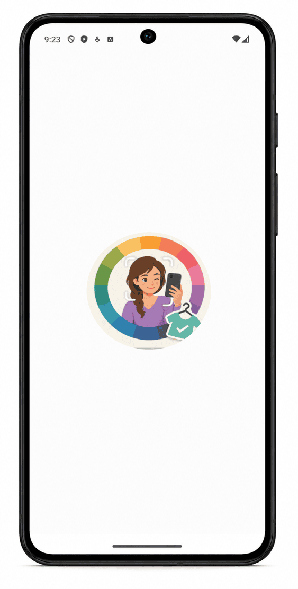<br/><b>Splash Screen</b></td>
<td align="center" width="33%">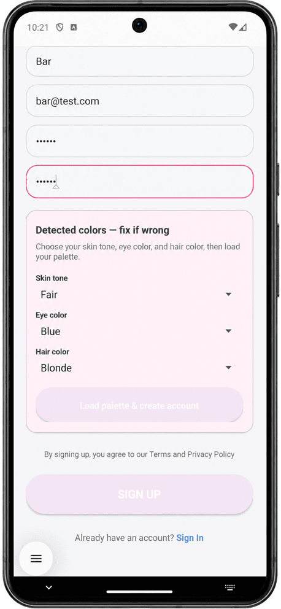<br/><b>Registration — Trait Confirmation</b></td>
<td align="center" width="33%">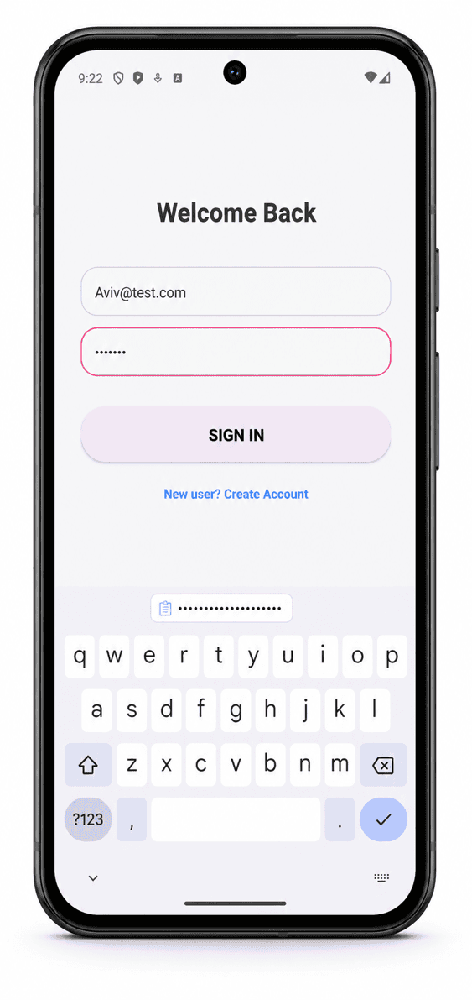<br/><b>Login</b></td>
</tr>
<tr>
<td align="center">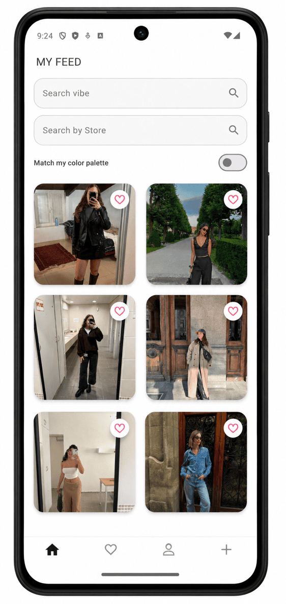<br/><b>Main Feed</b></td>
<td align="center">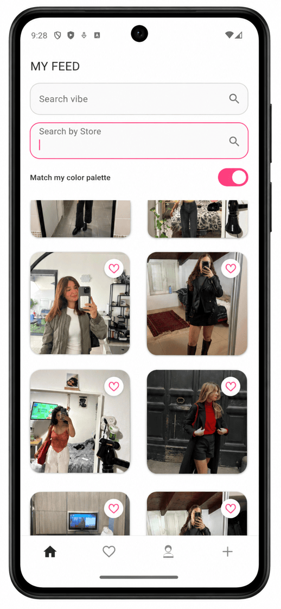<br/><b>Match My Color Palette</b></td>
<td align="center">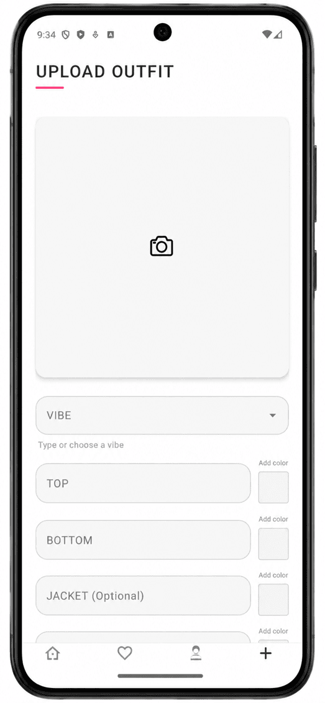<br/><b>Upload Outfit</b></td>
</tr>
<tr>
<td align="center">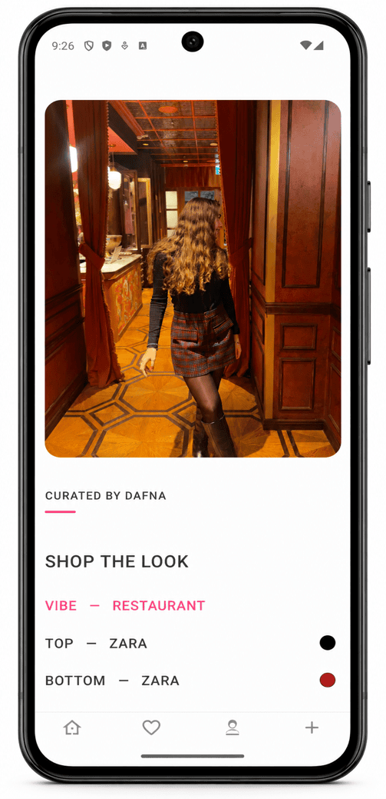<br/><b>Outfit Details</b></td>
<td align="center">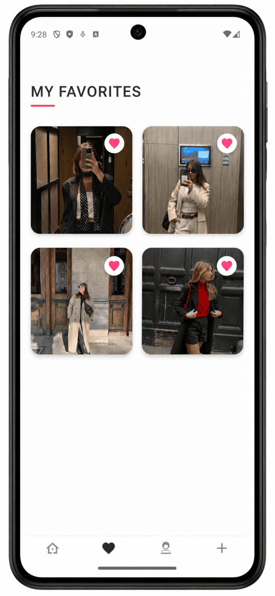<br/><b>Favorites</b></td>
<td align="center">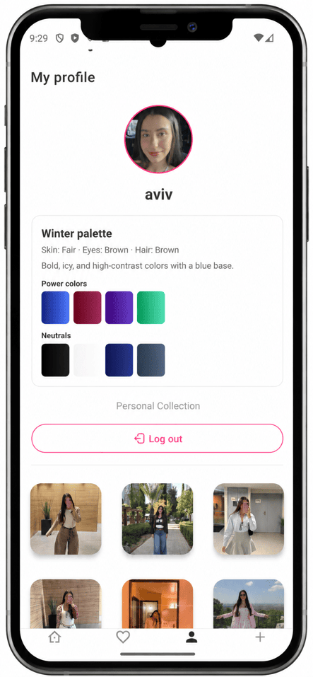<br/><b>Profile & Personal Palette</b></td>
</tr>
</table>

## 🏗️ System Architecture

<div align="center">
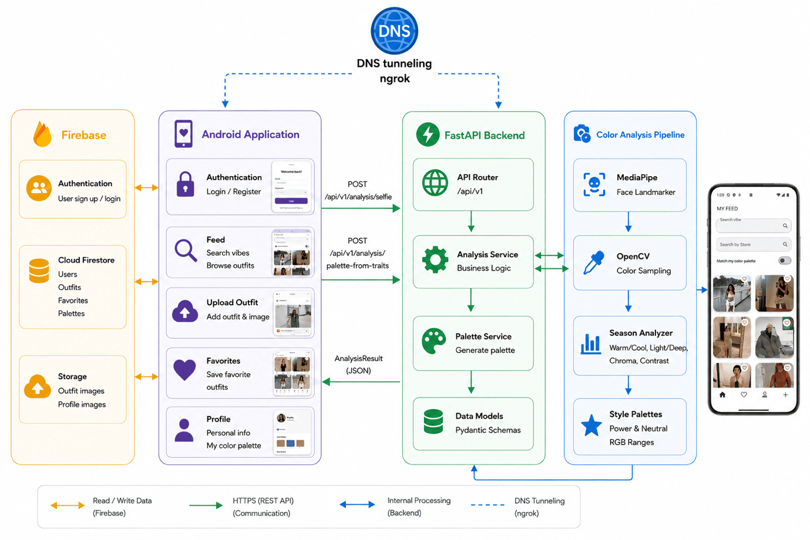
</div>

The Android app talks to two independent services:

- **Firebase** (Auth + Firestore + Storage) for everything social: accounts, the outfit feed, favorites, and media.
- **FastAPI Backend** (fronted by an `ngrok` tunnel during development) purely for selfie → color analysis, via `POST /api/v1/analysis/selfie` and `POST /api/v1/analysis/palette-from-traits`.

The backend's **Color Analysis Pipeline** (MediaPipe + OpenCV) extracts facial color samples, the **Season Analyzer** classifies the user into a season, and **Style Palettes** returns the matching power/neutral color set — all packaged as an `AnalysisResult` and returned to the app.

## 📂 Repository Structure

```
StylePalette/
├── app/                                  # Android application (Gradle project root)
│   ├── app/
│   │   ├── build.gradle.kts              # applicationId, minSdk 26 / targetSdk 36, dependencies
│   │   ├── google-services.json          # Firebase project config
│   │   └── src/main/java/com/example/myapplication/
│   │       ├── App.kt                    # Application class, Firestore/App Check setup
│   │       ├── BaseActivity.kt           # Shared bottom-nav wiring
│   │       ├── LoginActivity.kt / RegisterActivity.kt
│   │       ├── MainActivity.kt           # Outfit feed, search, palette filter
│   │       ├── UploadOutfitActivity.kt   # Create outfit + per-garment color picker
│   │       ├── OutfitDetailActivity.kt   # View/delete a single outfit
│   │       ├── FavoritesActivity.kt      # Liked outfits
│   │       ├── ProfileActivity.kt        # Palette summary + user's outfits
│   │       ├── BackendApi.kt             # HTTP client for the FastAPI backend
│   │       ├── FeedOrderMixer.kt         # Feed interleaving algorithm
│   │       ├── FeedPaletteMatcher.kt     # Palette-based outfit filtering
│   │       ├── adapters/OutfitAdapter.kt
│   │       ├── ui/OutfitColorPicker.kt
│   │       ├── repository/               # AuthRepository, OutfitRepository (Firestore/Storage)
│   │       └── models/                   # Outfit, OutfitRgb, PersonalPalette, PaletteSwatch, User, AppConfig, FeedFilters
│   └── firestore.rules                   # Firestore security rules
│
├── backend/                              # FastAPI backend
│   ├── RestAPI.py                        # Uvicorn ASGI entrypoint
│   ├── requirements.txt
│   ├── .env.example
│   └── app/
│       ├── main.py                       # FastAPI app factory, CORS, router mounting
│       ├── config.py                     # Settings (host/port, CORS, MediaPipe model options)
│       ├── api/v1/
│       │   ├── router.py
│       │   └── endpoints/{health,analysis}.py
│       ├── services/
│       │   ├── analysis.py               # Trait classification + orchestration
│       │   └── season_analyzer.py        # Seasonal Color Theory rule engine
│       ├── domain/
│       │   ├── enums.py                  # SkinType, HairColor, EyeColor, Season
│       │   └── style_palettes.py         # Power/neutral RGB ranges per season
│       ├── cv/
│       │   ├── detection.py              # MediaPipe Face Landmarker loading/inference
│       │   ├── skin.py / eyes.py / hair.py
│       │   └── facial_color_analysis.py
│       └── schemas/                      # Pydantic request/response models
│
└── docs/assets/                          # README diagrams and screenshots (from the project book)
```

## 📱 Android Application

- **Language/UI**: Kotlin 2.0.21, XML layouts (AndroidX AppCompat, Material Components 3, ConstraintLayout) — no Jetpack Compose.
- **App ID**: `com.example.myapplication`, `minSdk 26`, `targetSdk/compileSdk 36`, Java 11 bytecode target.
- **Screens**: `LoginActivity`, `RegisterActivity` (auth + selfie palette onboarding), `MainActivity` (feed), `UploadOutfitActivity`, `OutfitDetailActivity`, `FavoritesActivity`, `ProfileActivity`, wired together via a shared bottom navigation bar (`BaseActivity`).
- **Firebase integration**:
  - **Auth** — email/password sign-up and sign-in.
  - **Cloud Firestore** — `users/{uid}` (profile, `personalPalette`, `feedFilters`), `outfits/{outfitId}` (global feed), and a `users/{uid}/favorites/{outfitId}` subcollection for likes.
  - **Storage** — `outfits/{outfitId}.jpg` and `profile_images/{uid}.jpg`.
  - **App Check** — Debug provider in development, Play Integrity in release.
- **Backend integration**: `BackendApi.kt` talks to the FastAPI service over plain `HttpURLConnection` (multipart selfie upload + JSON trait-correction calls), executed off the main thread via an `ExecutorService`. The base URL is configured via the `backend_analysis_base_url` string resource and supports local IPs or an `ngrok` tunnel (ngrok URLs are auto-detected and sent with a bypass header).
- **Palette matching**: `FeedPaletteMatcher` checks whether a garment's RGB falls inside any of the user's power/neutral swatch ranges — an outfit is shown if **at least one** garment matches. `FeedOrderMixer` then interleaves the feed so the same author doesn't appear in consecutive slots.
- **Color picking**: `OutfitColorPicker` wraps the [Dhaval2404 ColorPicker](https://github.com/Dhaval2404/ColorPicker) library (common swatches, an extended HSV grid, or a color wheel) to let users assign a color per garment when uploading an outfit.
- **Tests**: JUnit unit tests under `app/app/src/test` (e.g. `FeedOrderMixerTest`), plus an instrumented test scaffold under `androidTest`.

## ⚙️ FastAPI Backend

<div align="center">
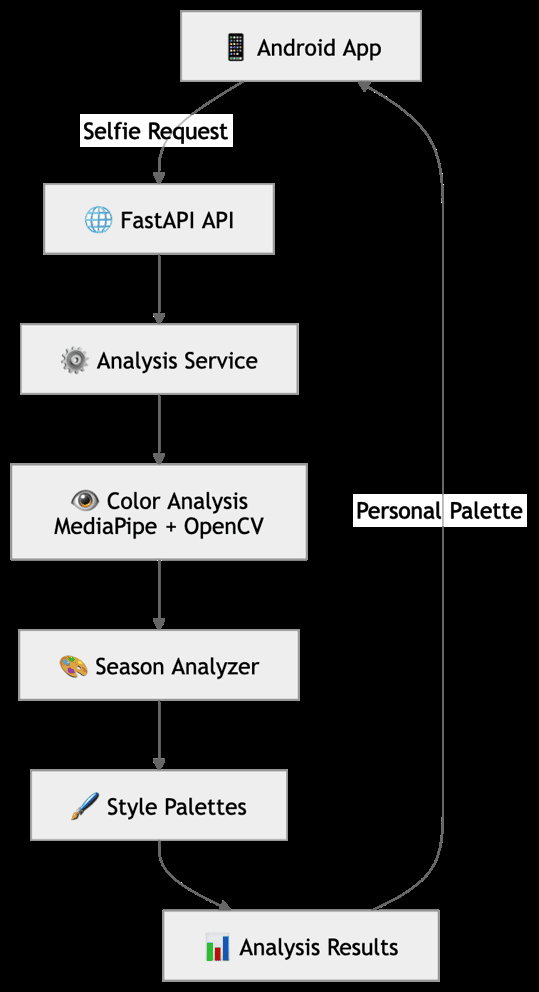
</div>

The FastAPI backend is the processing layer: it receives a selfie or confirmed traits from the Android app, runs the color analysis, and returns a structured `AnalysisResult`.

- **`app/main.py`** builds the FastAPI app, configures CORS from settings, and mounts the versioned `/api/v1` router.
- **`app/api/v1/`** — the **API Router** layer; directs `/analysis/*` and `/health` requests to the right handler.
- **`app/services/analysis.py`** — the **Analysis Service**; coordinates the CV pipeline and turns raw color samples into classified traits and a palette.
- **`app/cv/`** — the **Color Analysis** pipeline:
  - `detection.py` loads (and, if missing, downloads) the MediaPipe **Face Landmarker** model and runs facial landmark detection.
  - `skin.py`, `eyes.py`, `hair.py` sample region colors from landmark-based masks (skin tone via relative luminance, hair and eyes via HSV + Lab thresholds).
  - `facial_color_analysis.py` orchestrates the three samplers.
- **`app/services/season_analyzer.py`** — the **Season Analyzer**, described in detail below.
- **`app/domain/style_palettes.py`** — the **Style Palettes** service; maps each season to a curated set of power and neutral colors as inclusive RGB ranges.
- **`app/schemas/`** — Pydantic **Data Models** that validate and structure every request/response.

## 🎯 Seasonal Color Analysis Engine

Given a selfie, the pipeline extracts a representative skin, hair, and eye color, classifies each trait, and runs a three-test rule engine (`SeasonAnalyzer`) to pick one of four seasons and its matching palette:

<div align="center">
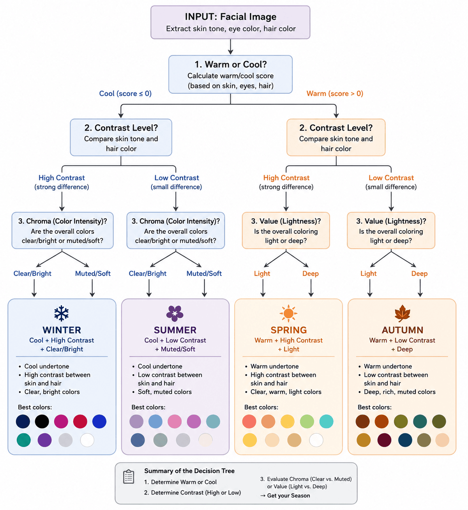
</div>

1. **Temperature test** — a weighted warm/cool score is computed across the detected skin tone, hair color, and eye color. A total score `> 0` is **Warm**; otherwise **Cool**.
2. **Contrast test** — compares skin tone against hair color; strong differences (e.g. fair skin + black hair, or dark skin + blonde hair) are **High** contrast, otherwise **Low**.
3. **Chroma & value test** — blue/green eyes or black/red hair are considered **Clear**, everything else **Muted**; fair/very-fair skin or blonde hair are considered **Light**, everything else **Deep**.

The final season combines all three results:

| Season | Rule | Description |
|---|---|---|
| ❄️ **Winter** | Cool, and (High contrast **or** Clear chroma) | Bold, icy, high-contrast colors with a blue base |
| 🌊 **Summer** | Cool, Low contrast, and Muted | Cool, soft, muted pastel tones with a blue base |
| 🌸 **Spring** | Warm, Light, and Clear | Bright, warm, clear colors with a yellow base |
| 🍂 **Autumn** | Warm, and anything else | Rich, earthy, deep colors with a gold base |

Each season maps to **4 power colors** and **4 neutral colors**, each stored as an inclusive RGB range rather than a single value, so nearby shades are also accepted. When an outfit is uploaded, the Android app checks whether each garment's RGB falls inside one of the palette's ranges — an outfit is considered a match if **at least one** garment's color falls within the viewer's palette.

Since MediaPipe has no dedicated hair landmarks, the hair region is estimated from a rectangle above the forehead, with dark/bright and low-saturation outlier pixels filtered out before averaging — a known source of reduced accuracy versus the landmark-driven skin and eye sampling.

## 🧰 Technologies

**Android**
- Kotlin 2.0.21, XML layouts (AndroidX AppCompat, Material Components 3, ConstraintLayout)
- Firebase BoM 34.8.0: Auth, Firestore, Storage, Analytics, App Check (Debug + Play Integrity)
- Glide 4.16.0 (async image loading/caching), Lottie 6.7.1 (loading animations)
- [Dhaval2404 ColorPicker](https://github.com/Dhaval2404/ColorPicker) 2.3 for garment color selection
- Plain `HttpURLConnection` for calling the FastAPI backend (no Retrofit/OkHttp dependency), off-loaded via `ExecutorService`
- JUnit for unit tests

**Backend**
- Python + [FastAPI](https://fastapi.tiangolo.com/) + [Uvicorn](https://www.uvicorn.org/) (ASGI)
- Pydantic v2 / `pydantic-settings` for typed config and request/response validation
- OpenCV (`opencv-python-headless`) + NumPy for color-space math (HSV, Lab, luminance)
- [MediaPipe](https://developers.google.com/mediapipe) Face Landmarker (478 facial landmarks) for face detection
- `python-multipart` for multipart selfie upload handling
- [ngrok](https://ngrok.com/) for tunneling the local dev server to a physical Android device

## 🚀 Installation

**Prerequisites**
- Backend: Python 3.10+
- Android: Android Studio, JDK 11, Android SDK (minSdk 26 / targetSdk 36)

```bash
git clone https://github.com/aviv-shemesh/StylePalette.git
cd StylePalette
```

## ▶️ Running the Backend

```bash
cd backend
python -m venv venv
source venv/bin/activate        # Windows: venv\Scripts\activate
pip install -r requirements.txt

cp .env.example .env            # adjust HOST/PORT/CORS_ORIGINS as needed

uvicorn RestAPI:app --reload --host 0.0.0.0 --port 8000
```

Relevant `.env` options (see `backend/.env.example`):

| Variable | Purpose |
|---|---|
| `HOST`, `PORT`, `DEBUG` | Server bind settings |
| `CORS_ORIGINS` | Comma-separated allowed origins (Android emulator commonly uses `http://10.0.2.2:8000`) |
| `MEDIAPIPE_ALLOW_MODEL_DOWNLOAD` | If `true` (default), downloads `face_landmarker.task` from Google on first analysis |
| `MEDIAPIPE_FACE_LANDMARKER_MODEL` | Optional path to a local `.task` model file |
| `MEDIAPIPE_FACE_LANDMARKER_URL` | Optional override download URL |

Once running, interactive API docs are available at `http://localhost:8000/docs`.

## ▶️ Running the Android Application

1. Open the `/app` directory in Android Studio.
2. The project already includes a Firebase `google-services.json` — replace it with your own Firebase project's config for Auth/Firestore/Storage if you're not using the bundled one.
3. Point the app at your backend by editing the `backend_analysis_base_url` string resource (`app/app/src/main/res/values/strings.xml`) — e.g. `http://10.0.2.2:8000` for the Android emulator, your machine's LAN IP for a physical device, or an `ngrok` tunnel URL.
4. Sync Gradle and run the `app` module on an emulator or device. The backend must be running and reachable at the configured URL for selfie analysis to work.

## 🔌 API Endpoints

| Method | Path | Description |
|---|---|---|
| `GET` | `/api/v1/health` | Liveness/status check |
| `POST` | `/api/v1/analysis/selfie` | Multipart selfie upload → estimated traits, sampled colors, seasonal palette |
| `POST` | `/api/v1/analysis/palette-from-traits` | JSON body of confirmed skin/eye/hair labels → seasonal palette |

Full request/response schemas are defined in `backend/app/schemas/analysis.py` and served live via FastAPI's `/docs` and `/redoc`.

Common error responses: `422 Unprocessable Entity` (invalid image or no face detected), `400 Bad Request` (invalid parameters), `500 Internal Server Error` (unexpected failure).

## 🔮 Future Improvements

As outlined in the project's final documentation, planned directions beyond the current implementation include:

- 👗 **Body shape detection & fit recommendations** — recommend cuts and silhouettes suited to the user's body shape, not just color.
- 🤖 **Automatic clothing & color detection** — use AI to auto-detect a garment's type and color from the outfit photo instead of manual tagging.
- 📈 **Scalability** — a production-grade infrastructure to support many concurrent users and image-processing requests.
- 🧕 **Preference-based filtering** — let users filter recommendations by personal style requirements (e.g. sleeve length, coverage) in addition to color.

Additional engineering gaps identified while reviewing the current codebase (not covered by the project book):
- No automated backend test suite or CI/CD pipeline.
- No `Dockerfile` for containerized backend deployment.
- No `LICENSE` file declared for the repository.

## 👥 Authors

| | |
|---|---|
| **Students** | Aviv Shemesh , Dafna Simhon |
| **Program** | B.Sc. in Computer Science |
| **Institution** | Afeka Academic College of Engineering |
| **Project Supervisor** | Victor Taubkin |
| **Academic Year** | 2025–2026 |
